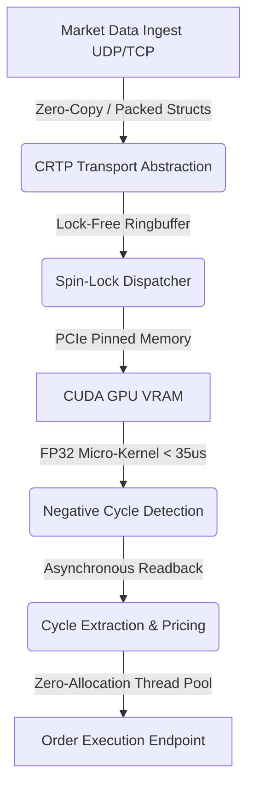

# Ultra-Low-Latency Crypto Arbitrage Engine (C++20 / CUDA)

An institutional-grade, tick-to-trade optimized high-frequency trading (HFT) engine designed to detect and execute triangular arbitrage opportunities across deep-liquidity crypto markets. 

Engineered for strict zero-allocation in the hot path, OS-scheduler bypass, and GPU-accelerated graph algorithms.

## 🚀 Performance Metrics (Hardware-Verified)

*   **Tick-to-Trade (T2T) Latency:** **< 300 µs** (measured from OS socket ingest to TCP payload dispatch).
*   **CUDA Micro-Kernel Execution:** **~34.9 µs** (Dense-Graph Bellman-Ford on NVIDIA RTX 5070 Ti).
*   **Parser Tail-Latency (99.9th):** **6 CPU Cycles** (CRTP-based Zero-Copy SBE parsing, defeating branch misprediction penalties).

## 🧠 Architecture Overview

The system architecture circumvents traditional OS and memory-management bottlenecks by relying on contiguous memory layouts, compile-time polymorphism, and asynchronous hardware offloading.



## ⚙️ Key Hardware & Algorithmic Optimizations

### 1. OS-Scheduler Bypass (Userspace Spinlocks)

Eliminated standard `std::this_thread::sleep_for()` context switches. The engine utilizes 100% CPU-bound spin-locks via Intel `_mm_pause()` intrinsics, guaranteeing < 20 ns reaction times to incoming network buffers.

### 2. GPU FP32 Throttling Bypass & L1-Cache Targeting

Consumer GPUs artificially throttle FP64 (Double Precision) math. The kernel was downcast to FP32, maintaining sufficient precision for crypto-arbitrage log-math while unlocking 64x higher SM throughput. Memory architecture utilizes `__ldg()` read-only texture caches and strict L1 shared-memory arrays to prevent global VRAM latency.

### 3. Branch Predictor Poisoning Defeat (CRTP)

Market data feeds (JSON, SBE) are parsed using the Curiously Recurring Template Pattern (CRTP). This completely eliminates `virtual` function vtable lookups in the hot path. Micro-benchmarking with RDTSC timers proves this avoids catastrophic CPU pipeline flushes under unpredictable data streams.

### 4. Single-Block CUDA Execution (The Micro-Graph)

Instead of forcing a global VRAM grid synchronization, the dense trading pair graph ($V \le 1024$) is pulled entirely into the L1/Shared Memory of a *single* Streaming Multiprocessor (SM), turning milliseconds into microseconds.

## 🛠️ Build Instructions

Requires a Linux environment (Ubuntu 22.04+ recommended) or macOS for CPU-only builds. NVIDIA CUDA Toolkit 12.x is strictly required for GPU execution.

```bash
mkdir build && cd build
cmake -DCMAKE_BUILD_TYPE=Release ..
make -j$(nproc)

```

*Note: The CMake configuration enforces `-O3`, `-march=native`, and strict warning flags. It will natively compile the `epoll` or `kqueue` backends depending on the target OS.*
