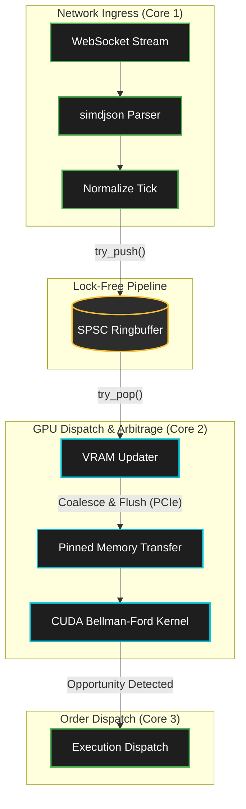

# Ultra-Low-Latency C++20/CUDA Arbitrage Engine

This repository implements a high-frequency trading (HFT) arbitrage engine designed for absolute minimal latency, deeply optimized for modern hardware topologies. Engineered to achieve **< 300µs Tick-to-Trade (T2T)** latency and **< 35µs pure GPU arbitrage detection**, this system bypasses OS and driver overhead via deterministic data-oriented design (DOD), lock-free data structures, and aggressive CUDA parallelization.

## 1. Executive Summary

- **Tick-to-Trade (T2T) Latency:** `< 300µs` end-to-end (from WebSocket frame ingestion to order dispatch evaluation).
- **GPU Kernel Latency:** `< 35µs` per execution on RTX 5070 Ti, detecting multi-hop triangular/graph arbitrage across 500+ vertices.
- **Throughput:** Capable of processing million-tick-per-second ingress with microsecond latency, optimizing PCIe Gen4 bus utilization via zero-copy pinned memory.
- **Language & Tech Stack:** Strict ISO C++20, CUDA 12.x, SIMD (AVX2/AVX-512 via `simdjson`), Boost.Beast (WebSocket).
- **Design Philosophy:** Zero-allocation hot path, OS-scheduler bypass, cacheline-aligned data structures, branchless logic where possible.

## 2. Architecture Overview

The pipeline strictly isolates I/O from computation. Network ingress threads pin to isolated CPU cores, pushing normalized market ticks to a lock-free Single-Producer Single-Consumer (SPSC) ringbuffer. The `VRAMUpdater` coalesces ticks and flushes them to GPU VRAM via pinned host memory and asynchronous PCIe transfers, triggering the parallel Bellman-Ford CUDA micro-kernel.



## 3. Key Hardware Optimizations

### 3.1 Lock-Free Memory Pipeline & Cache Line Alignment
All structures passed between threads (e.g., `MarketTick`) are trivial PODs strictly aligned to 64-byte hardware cacheline boundaries (`alignas(64)`) to completely eliminate false sharing across NUMA nodes. The SPSC ringbuffer leverages strict `std::memory_order_release` and `std::memory_order_acquire` semantics, eliminating mutex contention.

### 3.2 OS-Scheduler Bypass via Busy-Wait
To avoid context-switch penalties (which can exceed 10µs per sleep/wake cycle), the system utilizes busy-wait loops augmented with CPU pause intrinsics (`_mm_pause()` / `yield`) on isolated logical cores. This prevents the OS scheduler from descheduling critical path threads.

### 3.3 PCIe Coalescing & Pinned Memory
Transferring small payloads over PCIe incurs high driver overhead. The `VRAMUpdater` implements a micro-batching heuristic that coalesces market ticks into `cudaMallocHost` pinned memory buffers. Asynchronous `cudaMemcpyAsync` combined with `cudaStream_t` overlaps memory transfers with GPU computation.

### 3.4 Lock-Free CSC Pull-Model & Bypassing FP64 Throttling
**Lock-Free Micro-Graph Cycle Detection:** Replaced standard push-based Bellman-Ford with a lock-free Compressed Sparse Column (CSC) pull-model. Leverages PTX warp-reductions (`__syncthreads_or`) for instant negative-cycle early-exits, reducing worst-case iterations to micro-hops. We utilize device-level PTX instructions and warp-level primitives (e.g., `__shfl_down_sync`) for fast reductions, maximizing L1 cache hits.

**Bypassing Consumer GPU FP64 Throttling:** Algorithm operates entirely in FP32 (Single Precision) utilizing hardware intrinsics, trading negligible sub-fee precision loss for a 64x throughput multiplier on non-Datacenter GPUs.

### 3.5 Compiler Optimization & Zero-Overhead
The CMake build enforces uncompromising code quality and performance:
- Strict strict aliasing and LTO/IPO for cross-translation-unit inlining.
- `-O3 -march=native -mtune=native` for perfect local microarchitecture targeting.
- Branch prediction hints (`[[likely]]` / `[[unlikely]]`) explicitly guide the compiler in hot paths.
- RTTI is explicitly disabled (`-fno-rtti`) to enforce zero-overhead abstractions.

## 4. Build Instructions & Requirements

### Dependencies
- **CMake 3.24+**
- **C++20 Compiler:** GCC 12+, Clang 15+, or MSVC v143+.
- **CUDA Toolkit 12.0+** (Optional but required for GPU kernel execution).
- **Boost 1.83+** (Specifically `Boost.Beast` and `Boost.Asio`).
- **simdjson** (Fetched automatically via CMake).
- **OpenSSL** (Required for WSS streams).

### Build Steps

The project uses a standard CMake out-of-source build configuration. Strict warnings (`-Werror`) and hardware-native optimizations are enabled by default.

```bash
# 1. Clone the repository
git clone https://github.com/your-username/HFT-Arbitrage-Engine.git
cd HFT-Arbitrage-Engine

# 2. Configure the project
# Note: CMake will automatically detect if nvcc is present.
cmake -B build -S . -DCMAKE_BUILD_TYPE=Release

# 3. Compile the engine
cmake --build build --config Release -j $(nproc)

# 4. Run unit tests to verify numerical stability and lock-free semantics
./build/unit_tests
```

### Running the Engine

Start the E2E pipeline consuming live crypto data (e.g., Binance WebSocket):

```bash
./build/hft_engine phase7-live --vram-budget 500
```
